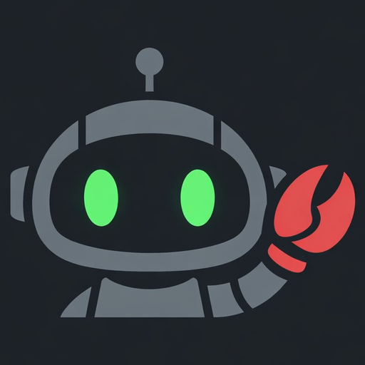
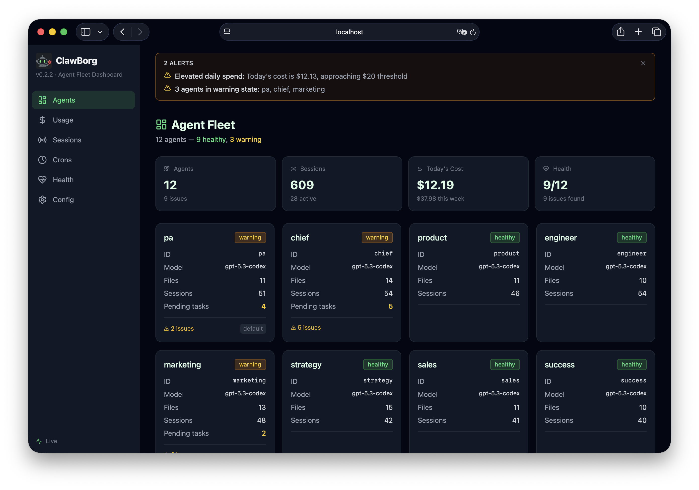
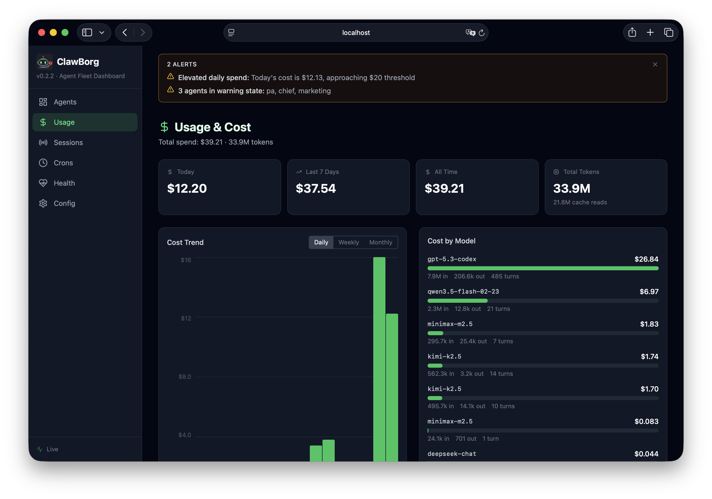
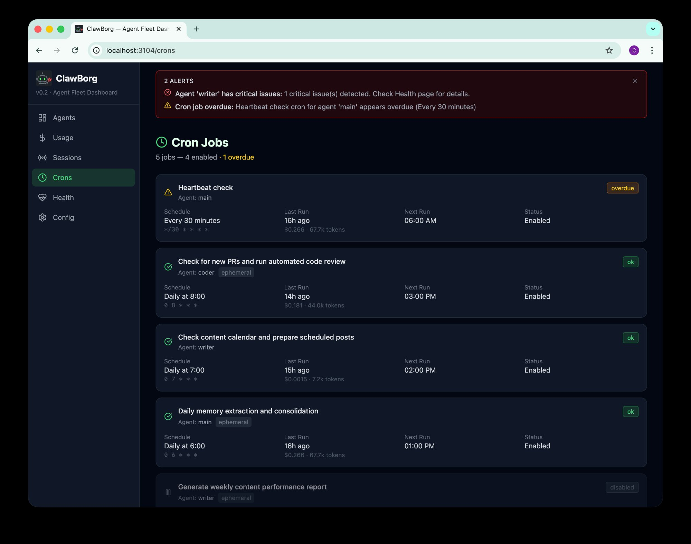
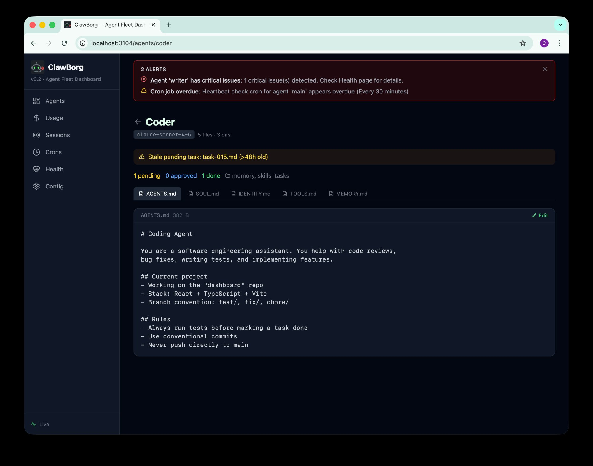

<div align="center">



```
  ██████╗██╗      █████╗ ██╗    ██╗██████╗  ██████╗ ██████╗  ██████╗
 ██╔════╝██║     ██╔══██╗██║    ██║██╔══██╗██╔═══██╗██╔══██╗██╔════╝
 ██║     ██║     ███████║██║ █╗ ██║██████╔╝██║   ██║██████╔╝██║  ███╗
 ██║     ██║     ██╔══██║██║███╗██║██╔══██╗██║   ██║██╔══██╗██║   ██║
 ╚██████╗███████╗██║  ██║╚███╔███╔╝██████╔╝╚██████╔╝██║  ██║╚██████╔╝
  ╚═════╝╚══════╝╚═╝  ╚═╝ ╚══╝╚══╝ ╚═════╝  ╚═════╝ ╚═╝  ╚═╝ ╚═════╝
```

**The fast, single-binary dashboard for OpenClaw AI agent fleets.**

[](https://github.com/clawborg/clawborg/releases)
[](LICENSE)
[](https://github.com/clawborg/clawborg/stargazers)
[](https://crates.io/crates/clawborg)
[](https://www.rust-lang.org)
[](#)

[Website](https://clawborg.dev) · [Documentation](https://clawborg.dev/docs) · [Changelog](CHANGELOG.md) · [Contributing](CONTRIBUTING.md)

<!-- TODO: add screenshot -->


</div>

---

## What is ClawBorg?

ClawBorg is a local web dashboard that gives you full visibility into your [OpenClaw](https://openclaw.ai) AI agent fleet. Point it at your `~/.openclaw/` directory and instantly see every agent's health, cost, sessions, and tasks — no config required.

It ships as a **single binary**. The React frontend is compiled into the Rust binary via `rust-embed`, so there's nothing to install, no Docker, and no database. Run `clawborg` and open your browser.

ClawBorg is a **read-only observer** by default. It never modifies your OpenClaw config or interferes with running agents. Opt-in write operations (editing `.md` files) create automatic backups.

## ✨ Features

| | Feature | Description |
|---|---|---|
| 🤖 | **Agent Fleet Overview** | Auto-discovers all agents from `openclaw.json`, shows health, workspace status, session count |
| 💸 | **Usage & Cost Dashboard** | Daily/weekly/monthly cost trends, per-model and per-agent breakdown, cache token tracking |
| 📋 | **Session Browser** | All sessions across all agents, cost per session, status detection, transcript links |
| ⏰ | **Cron Job Monitor** | Schedule viewer, last/next run times, overdue detection, run cost tracking |
| 🗂 | **File Browser** | Explore any agent's workspace, inline markdown preview and editor |
| 🚨 | **Smart Alerts** | Persistent banner for high cost, overdue crons, missing health files, agent warnings |
| ⚡ | **Real-time Updates** | WebSocket file watching — dashboard refreshes as agents write files |
| 📦 | **Single Binary** | Frontend embedded in Rust binary — `cargo install clawborg` and you're done |
| 🖥 | **Daemon Mode** | `clawborg start` / `stop` / `log` for background operation |

## 🚀 Quick Start

```bash
# Install
cargo install clawborg

# Run (auto-reads ~/.openclaw/)
clawborg
# → open http://localhost:3104
```

```bash
# Or run as a background daemon
clawborg start

# Follow live log output
clawborg log -f

# Stop the daemon
clawborg stop
```

```bash
# Point to a custom OpenClaw directory
clawborg --dir /path/to/.openclaw

# Read-only mode (disables file editing)
clawborg --readonly

# Different port
clawborg --port 8080
```

## 📸 Screenshots

<details>
<summary>Agent Fleet Dashboard</summary>


</details>

<details>
<summary>Usage & Cost</summary>


</details>

<details>
<summary>Cron Job Monitor</summary>


</details>

<details>
<summary>Agent Detail & File Browser</summary>


</details>

## ⚙️ Configuration

ClawBorg reads your OpenClaw config (`~/.openclaw/openclaw.json`) and never modifies it. Its own settings live in `~/.clawborg/config.toml`:

```toml
[alerts]
# Daily spend in USD that triggers a critical alert (red banner)
dailySpendThreshold = 10.0

# Daily spend that triggers a warning alert (yellow banner)
dailySpendWarning = 5.0
```

**CLI flags:**

| Flag | Env var | Default | Description |
|------|---------|---------|-------------|
| `--dir` | `OPENCLAW_DIR` | `~/.openclaw` | OpenClaw directory path |
| `--port` | — | `3104` | Dashboard port |
| `--readonly` | — | `false` | Disable write operations |
| `--no-watch` | — | `false` | Disable filesystem watching |

## 🖥 CLI Reference

| Command | Description |
|---------|-------------|
| `clawborg` | Run dashboard in foreground |
| `clawborg start` | Start as background daemon |
| `clawborg stop` | Stop the running daemon |
| `clawborg log` | Show last 50 log lines |
| `clawborg log -f` | Follow log output in real time |
| `clawborg health` | Run workspace health check (CLI output) |
| `clawborg agents` | List discovered agents and paths |
| `clawborg --version` | Show version |
| `clawborg help` | Show help |

## 🛠 Development

```bash
git clone https://github.com/clawborg/clawborg.git
cd clawborg

# Run backend with mock fixtures (no OpenClaw install needed)
cargo run -- --dir ./fixtures/mock-openclaw

# Frontend hot-reload (in a second terminal)
cd web && pnpm install && pnpm dev
# → Vite dev server on http://localhost:3103
# → Backend API on http://localhost:3104
```

**Tech stack:**
- Backend: [Rust](https://www.rust-lang.org) + [Axum](https://github.com/tokio-rs/axum) + [tokio](https://tokio.rs)
- Frontend: [React 19](https://react.dev) + [Vite](https://vitejs.dev) + [Tailwind CSS](https://tailwindcss.com) + [shadcn/ui](https://ui.shadcn.com) + [Recharts](https://recharts.org)
- Distribution: Single binary via [rust-embed](https://github.com/pyrossh/rust-embed)

## 🗺 Roadmap

- **v0.3** — Skills viewer, sub-agent tracker, dark/light theme toggle, health report export
- **v0.4** — Plugin system, custom dashboard widgets, agent comparison view
- **v1.0** — Stable API, Homebrew tap, Docker image, Windows support

## 🤝 Contributing

Contributions are welcome. See [CONTRIBUTING.md](CONTRIBUTING.md) for guidelines on branching, commit style, and how to run the test suite.

## 📄 License

[AGPL-3.0](LICENSE) — free to use, modify, and distribute under the same license.
